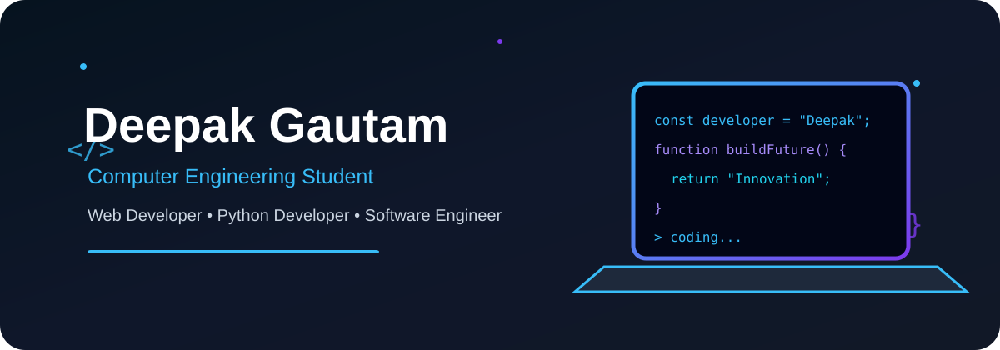

<div align="center">



<br><br>


<br><br>

<a href="https://github.com/Deepak1Gautam">

</a>

<a href="https://www.linkedin.com/in/deepak-gautam-82126b388">

</a>

<a href="mailto:deepakgautameng@gmail.com">

</a>

</div>

<br>

---

<div align="center">

## 🚀 About Me

</div>


👋 Hi, I'm **Deepak Gautam**, a passionate **Computer Engineering student** and aspiring **Software Engineer**.

🎓 Currently pursuing **B.Tech in Computer Engineering** at **Shri Vishwakarma Skill University**.

💻 I enjoy building:

- 🌐 Modern and responsive websites
- ⚡ Interactive frontend experiences
- 🐍 Python applications
- 🧠 Data Structures & Algorithms solutions
- 🚀 Creative software projects

<br>

### 🔥 Currently Learning

```text
Frontend Development     ████████████████████ 90%
Python & Django          ████████████████░░░░ 80%
Data Structures          ██████████████░░░░░░ 75%
Backend Development      ████████████░░░░░░░░ 65%

---

<div align="center">

## 🛠️ Tech Stack

<br>

### 💻 Languages


<br><br>

### ⚡ Frameworks & Tools


</div>

---

<div align="center">

## 🚀 Featured Projects

</div>

<table>
<tr>

<td width="50%">

<h3 align="center">🌐 Personal Portfolio</h3>

<p align="center">

A modern and responsive personal portfolio website with animations, dark mode and interactive UI.

<br><br>

<a href="https://codesoft-1-ten.vercel.app" target="_blank">

</a>

</p>

</td>

<td width="50%">

<h3 align="center">🛒 Amazon Clone</h3>

<p align="center">

A responsive Amazon-inspired e-commerce interface built using HTML and CSS.

<br><br>

<a href="https://github.com/Deepak1Gautam/Amazon-Clone" target="_blank">

</a>

</p>

</td>

</tr>

<tr>

<td width="50%">

<h3 align="center">🖱️ Virtual Keyboard & Mouse</h3>

<p align="center">

A computer vision project using Python, OpenCV and MediaPipe to control mouse and keyboard using hand gestures.

<br><br>


</p>

</td>

<td width="50%">

<h3 align="center">📊 Data Analysis Projects</h3>

<p align="center">

Data analysis and visualization projects using Tableau, Excel and AI-powered insights.

<br><br>


</p>

</td>

</tr>
</table>

---

<div align="center">

## 📊 GitHub Statistics

<br>


<br><br>


</div>

---

<div align="center">

## 🎯 My Goals

</div>

```text
🚀 Build impactful real-world software
💻 Become a skilled Software Engineer
🧠 Master Data Structures & Algorithms
🌐 Become a Full-Stack Developer
📚 Learn new technologies continuously
🔥 Keep building and improving every day
