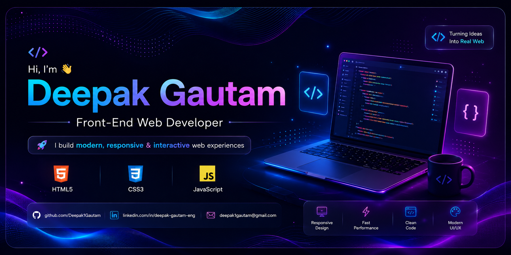

<!-- ========================= BANNER ========================= -->

<p align="center">
  
</p>

<h1 align="center">🚀 Personal Portfolio Website</h1>

<p align="center">
Modern • Responsive • Interactive • Animated
</p>

<p align="center">

<a href="https://codesoft-1-ten.vercel.app">


</a>

<a href="https://github.com/Deepak1Gautam/CODESOFT_1">


</a>

<a href="https://www.linkedin.com/in/deepak-gautam-eng">


</a>

</p>

---

# 🌟 About

A modern, responsive and interactive **Personal Portfolio Website**
built using **HTML, CSS & JavaScript**.

The website showcases my

- 👋 Introduction
- 💻 Skills
- 🚀 Projects
- 📄 Resume
- 📞 Contact Details

with beautiful animations and responsive design.

---

# ✨ Features

✅ Fully Responsive

✅ Modern UI

✅ Smooth Scrolling

✅ AOS Animations

✅ Dark Theme

✅ Download Resume

✅ Contact Form

✅ Social Links

✅ Mobile Friendly

---

# 🛠 Tech Stack

<p align="center">


</p>

---

# 📷 Project Gallery

<p align="center">


</p>

<br>

<p align="center">


</p>

<br>

---

# 📂 Folder Structure

```text
Portfolio/
│
├── assets/
├── css/
├── js/
├── screenshots/
├── index.html
└── README.md
```

---

# 📊 Project Highlights

| Feature | Status |
|----------|---------|
| Responsive Design | ✅ |
| Dark Theme | ✅ |
| Animations | ✅ |
| Mobile Friendly | ✅ |
| Resume Download | ✅ |
| Contact Form | ✅ |

---

# 🚀 Live Preview

### 🌐 Live Website

https://codesoft-1-ten.vercel.app

### 📂 GitHub Repository

https://github.com/Deepak1Gautam/CODESOFT_1

---

# 👨‍💻 Author

### Deepak Gautam

Front-End Web Developer

---

<p align="center">

### ⭐ If you like this project, don't forget to Star the Repository ⭐

</p>

---

<p align="center">
Made with ❤️ using HTML, CSS & JavaScript
</p>
