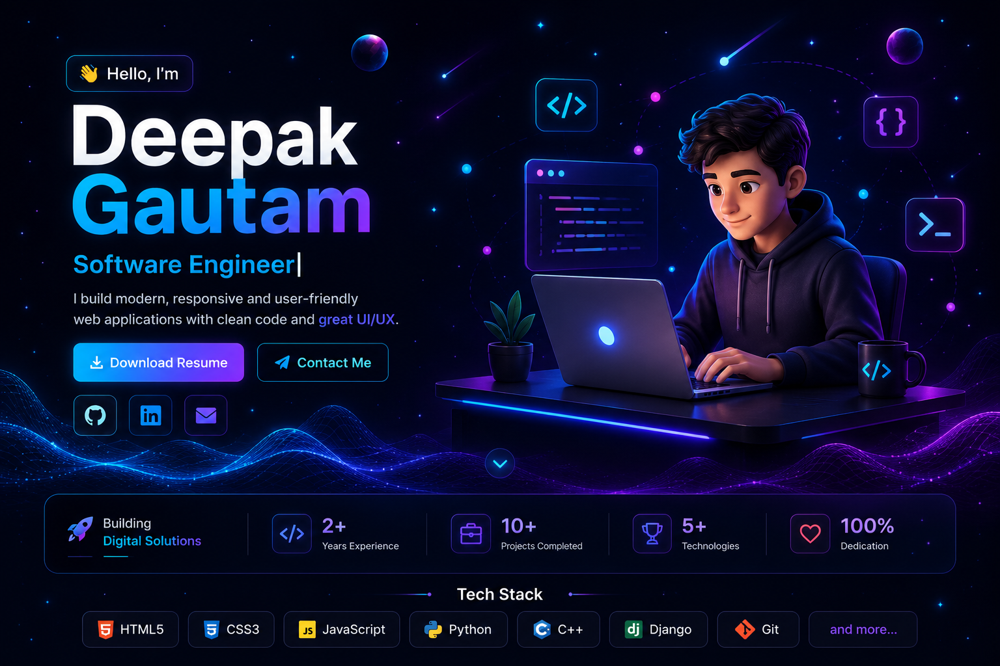
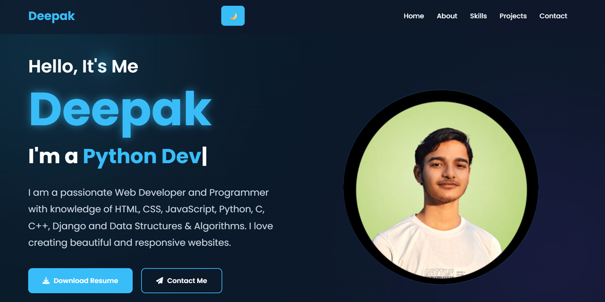
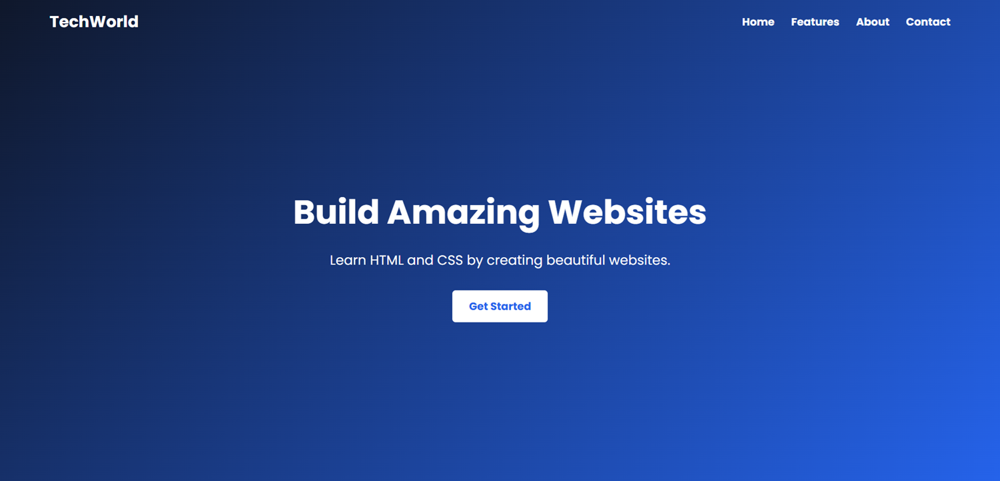
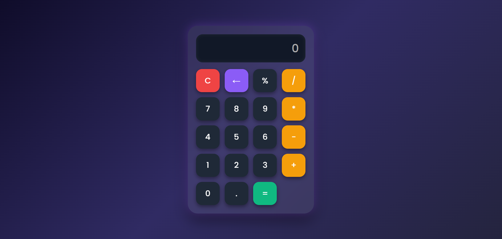

<h1 align="center">🌟 Personal Portfolio Website</h1>

<p align="center">
  <b>A modern, responsive and interactive portfolio website built using HTML, CSS & JavaScript.</b>
</p>

<p align="center">
Showcasing my skills, projects, and experience through a clean, responsive and visually appealing portfolio.
</p>

<p align="center">

<a href="https://codesoft-1-ten.vercel.app" target="_blank">

</a>

<a href="https://github.com/Deepak1Gautam/codesoft_1" target="_blank">

</a>

</p>

<p align="center">


</p>

---

# 📸 Portfolio Preview

<p align="center">

</p>

---

# ✨ Features

- 🎨 Modern & Minimal UI
- 📱 Fully Responsive Design
- ⚡ Smooth Animations
- 🌙 Dark Theme
- 💻 Skills Showcase
- 🚀 Projects Section
- 📄 Resume Download
- 📬 Contact Form
- 🔗 Social Media Links
- ⚡ Fast Loading

---

# 🛠️ Tech Stack

<p align="center">


</p>

---

# 📂 Project Structure

```text
codesoft_1
│
├── assets/
│   ├── images/
│   ├── icons/
│
├── css/
│
├── js/
│
├── screenshots/
│   ├── home.png
│   ├── about.png
│   ├── projects.png
│   └── contact.png
│
├── resume/
│
├── index.html
│
└── README.md
```

---

# 📷 Screenshots

<table align="center">

<tr>

<td align="center">
<br><br>
<b>👤 Profile</b>
</td>

<td align="center">
<br><br>
<b>🚀 Project 1</b>
</td>

</tr>

<tr>

<td align="center">
<br><br>
<b>🚀 Project 2</b>
</td>

<td align="center">
<br><br>
<b>🚀 Project 3</b>
</td>

</tr>

</table>

# 🚀 Getting Started

### Clone Repository

```bash
git clone https://github.com/Deepak1Gautam/codesoft_1.git
```

### Go to Project Folder

```bash
cd codesoft_1
```

### Run the Project

Open **index.html** in your favourite browser.

---

# 🌐 Live Demo

### 🔗 https://codesoft-1-ten.vercel.app

---

# 👨‍💻 About This Project

This portfolio website was created to showcase my skills, projects, achievements, and resume in a professional and user-friendly way. It follows modern web development practices with a responsive layout, clean UI, and smooth user experience across all devices.

---

# 🤝 Connect With Me

<p align="center">

<a href="https://github.com/Deepak1Gautam">

</a>

&nbsp;&nbsp;&nbsp;

<a href="https://www.linkedin.com/in/deepak-gautam-eng">

</a>

</p>

---

<div align="center">

### ⭐ If you found this project helpful, don't forget to Star this repository!

</div>

---

<p align="center">
Made with ❤️ by <b>Deepak Gautam</b>
</p>
